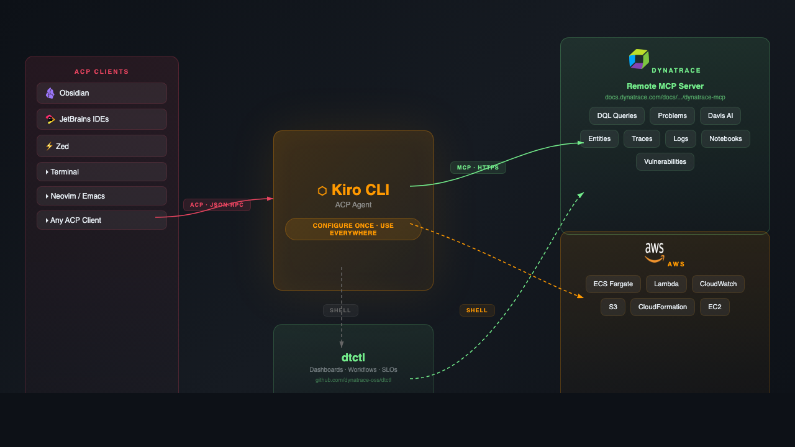

# Kiro + Dynatrace: AI-Powered Observability Everywhere

Bring [Dynatrace](https://www.dynatrace.com/) observability into any editor, app, or terminal — powered by [Kiro CLI](https://kiro.dev/cli/) and the open [Agent Client Protocol (ACP)](https://agentclientprotocol.com/).

Query logs, investigate incidents, build dashboards, and correlate AWS health with Dynatrace data — from your terminal, your IDE, or even your note-taking app.

## Why ACP Changes Everything

Kiro CLI implements ACP, the open standard for agent-editor communication (think LSP, but for AI agents). Configure Dynatrace once, and it's available everywhere:



## What You Get

- **Natural language DQL** — Query logs, metrics, and traces in plain English
- **Incident investigation** — Pull problems, root causes, and affected entities automatically
- **Dashboard-as-code** — Create, modify, and deploy dashboards with dtctl
- **AWS + Dynatrace correlation** — Cross-reference AWS resource health with observability data
- **Works everywhere** — Terminal, JetBrains, Zed, Obsidian, or any ACP-compatible app

## Prerequisites

- [Kiro CLI](https://kiro.dev/downloads/) installed
- A [Dynatrace SaaS environment](https://www.dynatrace.com/trial/) (Platform subscription)
- A [Dynatrace Platform Token](https://myaccount.dynatrace.com/platformTokens) with MCP scopes
- (Optional) [dtctl](https://github.com/dynatrace-oss/dtctl) for dashboard/workflow/SLO management
- (Optional) [AWS CLI](https://aws.amazon.com/cli/) for AWS scenarios

## Quick Start

### 1. Create a Dynatrace Platform Token

1. Go to [myaccount.dynatrace.com/platformTokens](https://myaccount.dynatrace.com/platformTokens)
2. Click **Platform token** → name it (e.g., `kiro-mcp`)
3. Select scopes: `mcp-gateway:servers:invoke`, `mcp-gateway:servers:read`, `storage:*:read`, `davis-copilot:*:execute`, `automation:workflows:read`, `document:documents:read`
4. Click **Generate** and copy the token

### 2. Set environment variables

```bash
export DT_TENANT="YOUR-ENV-ID"          # e.g., abc12345
export DT_PLATFORM_TOKEN="dt0s16...."   # the token you just created
```

### 3. Clone and run

```bash
git clone https://github.com/jasonmimick-aws/kiro-dynatrace-acp-starter.git
cd kiro-dynatrace-acp-starter
kiro-cli chat
```

The `.kiro/settings/mcp.json` in this repo connects to the [Dynatrace remote MCP server](https://docs.dynatrace.com/docs/discover-dynatrace/platform/davis-ai/dynatrace-mcp) — no Node.js or local server needed.

### 4. Try it

```
You: Show me error logs from the last hour
You: Are there any open problems in my environment?
You: Create a dashboard showing request latency for my top 5 services
```

## MCP Configuration

### Remote server (recommended)

Connects directly to Dynatrace's hosted MCP gateway. No local dependencies beyond Kiro CLI.

`.kiro/settings/mcp.json` (included in this repo):
```json
{
  "mcpServers": {
    "dynatrace": {
      "url": "https://${DT_TENANT}.apps.dynatrace.com/platform-reserved/mcp-gateway/v0.1/servers/dynatrace-mcp/mcp",
      "headers": {
        "Authorization": "Bearer ${DT_PLATFORM_TOKEN}"
      }
    }
  }
}
```

### Local server (alternative)

Runs the open-source MCP server locally. Requires Node.js 18+. Uses browser-based OAuth (no token needed). See `.kiro/settings/mcp.local.json`:

```json
{
  "mcpServers": {
    "dynatrace": {
      "command": "npx",
      "args": ["-y", "@dynatrace-oss/dynatrace-mcp-server@latest"],
      "env": {
        "DT_ENVIRONMENT": "https://YOUR-ENV-ID.apps.dynatrace.com"
      }
    }
  }
}
```

To use the local server, rename `mcp.local.json` to `mcp.json`.

## ACP Client Setup

Kiro works as an ACP agent in any compatible editor. The Dynatrace MCP config travels with it.

### Terminal
```bash
kiro-cli chat
```

### Obsidian
1. Install [Obsidian](https://obsidian.md/download) (free, no account)
2. Install the [Agent Client plugin](https://github.com/RAIT-09/obsidian-agent-client) via BRAT
3. Add Kiro as a custom agent:

   | Field | Value |
   |-------|-------|
   | Agent ID | `kiro-cli` |
   | Display name | `Kiro` |
   | Path | `/path/to/kiro-cli` (run `which kiro-cli`) |
   | Arguments | `acp --trust-all-tools` |

4. Open `obsidian-vault/` for sample notes and prompts

Kiro picks up your Dynatrace MCP config from `~/.kiro/settings/mcp.json` automatically — no need to duplicate credentials in Obsidian.

### JetBrains IDEs

Add to `~/.jetbrains/acp.json`:
```json
{
  "agent_servers": {
    "Kiro + Dynatrace": {
      "command": "/path/to/kiro-cli",
      "args": ["acp", "--trust-all-tools"]
    }
  }
}
```

### Zed

Add to `~/.config/zed/settings.json`:
```json
{
  "agent_servers": {
    "Kiro + Dynatrace": {
      "type": "custom",
      "command": "/path/to/kiro-cli",
      "args": ["acp", "--trust-all-tools"],
      "env": {}
    }
  }
}
```

## dtctl: Dashboard, Workflow & SLO Management

The MCP server handles querying and investigation. [dtctl](https://github.com/dynatrace-oss/dtctl) handles resource management — dashboards, workflows, SLOs as version-controllable YAML. The agent skill that teaches Kiro how to use dtctl is already included in this repo.

```bash
brew install dynatrace-oss/tap/dtctl
dtctl auth login --context my-env --environment "https://YOUR-ENV-ID.apps.dynatrace.com"
dtctl doctor   # verify connection
```

| MCP Server (query & investigate) | dtctl (manage & deploy) |
|---|---|
| Query logs, metrics, traces | Create/edit/delete dashboards |
| List problems & vulnerabilities | Deploy workflows from YAML |
| Davis AI analysis | Manage SLOs, settings, segments |
| Create notebooks | Pull resources as YAML for git |
| Send notifications | Multi-environment switching |

## Example Scenarios

| Scenario | Description | Tools Used |
|----------|-------------|------------|
| [Incident Investigation](docs/scenarios/incident-investigation.md) | Investigate a production issue end-to-end | MCP + dtctl + AWS CLI |
| [Obsidian + Dynatrace](docs/scenarios/obsidian-observability.md) | Query Dynatrace from your meeting notes | MCP + dtctl |
| [AWS ECS + Dynatrace](docs/scenarios/aws-ecs-monitoring.md) | Monitor ECS services with Dynatrace | MCP + dtctl + AWS CLI |
| [Dashboard-as-Code](docs/scenarios/dashboard-as-code.md) | Version-control dashboards | dtctl |
| [Lambda Error Correlation](docs/scenarios/lambda-error-correlation.md) | Correlate Lambda errors with traces | MCP + AWS CLI |
| [Automated Rollback](docs/scenarios/automated-rollback.md) | Self-healing deployment workflows | MCP + dtctl + AWS CLI |

## Project Structure

```
.
├── .kiro/
│   ├── settings/
│   │   ├── mcp.json                  # Remote MCP server config (recommended)
│   │   └── mcp.local.json            # Local MCP server config (alternative)
│   └── skills/
│       └── dtctl/                    # Agent skill for dtctl (ships with repo)
├── obsidian-vault/                    # Sample Obsidian vault
│   ├── Welcome.md
│   ├── Setup Guide.md
│   └── Incident Review - 2026-03-15.md
├── docs/
│   ├── scenarios/                     # Step-by-step scenario guides
│   └── blog/                          # Blog post drafts
├── examples/
│   ├── dashboards/                    # Example dashboard YAML files
│   ├── workflows/                     # Example workflow definitions
│   └── dql/                           # Useful DQL query templates
├── setup.sh                           # Setup script
└── README.md
```

## Blog Posts

- [Stop Tab-Switching to Investigate Incidents with Kiro + Dynatrace](docs/blog/kiro-meets-dynatrace.md)
- [5 AWS + Dynatrace Scenarios You Can Run from Kiro CLI](docs/blog/aws-dynatrace-scenarios.md)

## License

Apache-2.0
