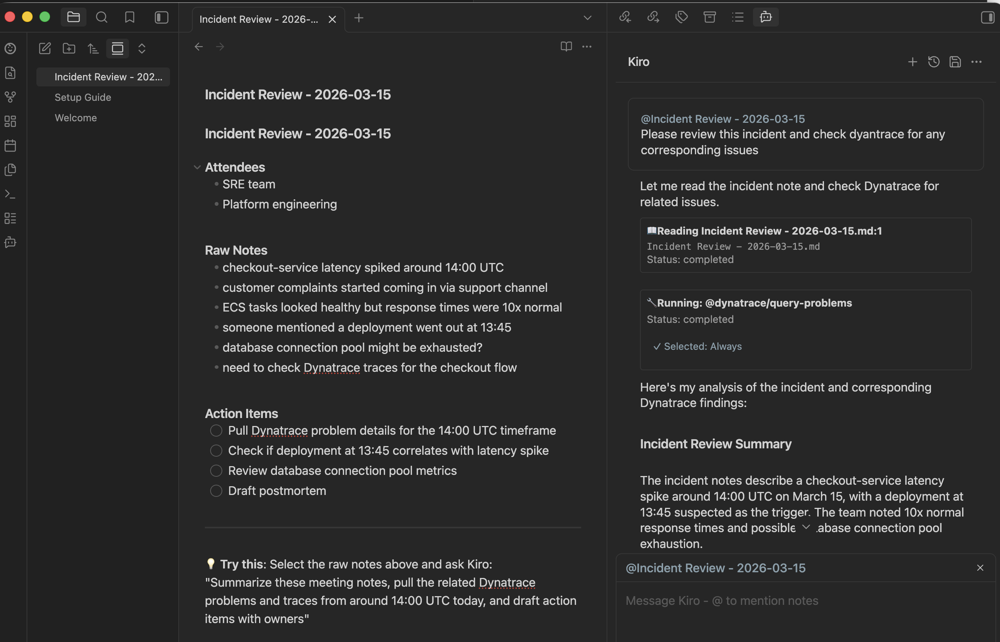

# Stop Tab-Switching to Investigate Incidents with Kiro + Dynatrace


<p>
 <strong>Dynatrace</strong> &nbsp;·&nbsp;
 <strong>AWS</strong> &nbsp;·&nbsp;
<strong>Kiro CLI</strong> &nbsp;·&nbsp;
<strong>ACP</strong>
</p>

**TL;DR:** Kiro CLI implements the Agent Client Protocol (ACP), which means it works as an AI agent in any compatible app — not just the terminal. Pair it with the Dynatrace MCP server, and you can query logs, investigate incidents, and manage dashboards from Obsidian, JetBrains, Zed, or anywhere else. Here's how we set it up and what it looks like in practice.

---

## The workflow that was slowing me down

I take notes in Obsidian. I investigate production issues in Dynatrace. I manage infrastructure in AWS. These three worlds never talked to each other.

My workflow looked like this: take messy meeting notes about an incident, switch to Dynatrace to pull traces and problems, switch to the AWS console to check ECS task health, then switch back to my notes to write it all up. Every context switch cost me time and mental energy.

What I wanted: ask questions about Dynatrace data without leaving my notes. And not just in Obsidian — in whatever tool I happen to be working in.

## ACP makes Kiro composable

[Kiro CLI](https://kiro.dev/cli/) added support for the [Agent Client Protocol (ACP)](https://agentclientprotocol.com/) — an open standard that works like LSP, but for AI agents. Any ACP-compatible application can spawn `kiro-cli acp` and communicate with it over JSON-RPC.

This means Kiro isn't locked to the terminal. It's a composable agent that works in:
- **JetBrains IDEs** (IntelliJ, DataGrip, PyCharm, etc.)
- **Zed**
- **Obsidian** (via the [Agent Client plugin](https://github.com/RAIT-09/obsidian-agent-client))
- **Eclipse, Neovim, Emacs**, and any future ACP client

The critical part: Kiro's MCP server configuration travels with it. Configure Dynatrace once, and every ACP client gets access to the same Dynatrace tools.

## Setting up Kiro + Dynatrace 

Dynatrace provides a [remote MCP server](https://docs.dynatrace.com/docs/discover-dynatrace/platform/davis-ai/dynatrace-mcp) — hosted on their platform, no local dependencies. You connect to it with a URL and a platform token.

### 1. Create a platform token

Go to [myaccount.dynatrace.com/platformTokens](https://myaccount.dynatrace.com/platformTokens), create a token with scopes for MCP gateway access, storage reads, and Davis AI.

### 2. Configure the MCP server

Follow the [Dynatrace MCP server setup guide](https://docs.dynatrace.com/docs/discover-dynatrace/platform/davis-ai/dynatrace-mcp) to connect Kiro. Create `~/.kiro/settings/mcp.json`:

```json
{
  "mcpServers": {
    "dynatrace": {
      "url": "https://${DT_TENANT}.apps.dynatrace.com/platform-reserved/mcp-gateway/v0.1/servers/dynatrace-mcp/mcp",
      "headers": {
        "Authorization": "Bearer ${DT_PLATFORM_TOKEN}"
      }
    }
  }
}
```

Set the environment variables:

```bash
export DT_TENANT="abc12345"
export DT_PLATFORM_TOKEN="dt0s16...."
```

That's it — Kiro now has access to your entire Dynatrace environment. Next, let's add the ability to create and manage resources.

### 3. Install dtctl and the agent skill

[dtctl](https://github.com/dynatrace-oss/dtctl) is a kubectl-inspired CLI for Dynatrace. It handles the write path — creating dashboards, workflows, and SLOs. But Kiro doesn't know dtctl exists by default. You teach it by adding an **agent skill** — a markdown file that describes dtctl's commands and when to use them.

```bash
brew install dynatrace-oss/tap/dtctl
dtctl auth login --context my-env --environment "https://YOUR-ENV-ID.apps.dynatrace.com"
```

The starter repo includes the skill file at `.kiro/skills/dtctl/SKILL.md`. When Kiro sees a request to create or modify a Dynatrace resource, it reads this skill file and knows to use `dtctl apply -f` instead of telling you to open the Dynatrace web UI.

### 4. Try it out in the terminal

Start a chat and verify everything works:

```bash
kiro-cli chat
```

Try these prompts to exercise the full stack:

```
Show me open Dynatrace problems
```

```
Query error logs from the last hour, limit 10
```

```
What services is Dynatrace monitoring?
```

```
Create a dashboard called "Test Dashboard" with one tile showing error rate for my top service
```

The first three use the MCP server (read path). The last one uses dtctl (write path) — Kiro generates a dashboard YAML and deploys it automatically. Here's a real dashboard Kiro created via dtctl:


The split is clean:
- **MCP server** → read path (query, investigate, analyze)
- **dtctl** → write path (create, edit, deploy, version-control)

## Now bring it to Obsidian

This is where ACP pays off. Everything you just set up in Kiro CLI — the Dynatrace MCP server, dtctl, the agent skill — carries over automatically. No reconfiguration needed.

I installed the [Agent Client plugin](https://github.com/RAIT-09/obsidian-agent-client) in Obsidian, pointed it at `kiro-cli acp`, and that was it. Kiro picks up the Dynatrace MCP config from `~/.kiro/settings/mcp.json` automatically — no tokens to duplicate, no environment variables to set in Obsidian.



Now I can:

- **Investigate incidents from my meeting notes.** I'm taking notes during an incident review, and I ask Kiro to pull the Dynatrace problems and traces for the timeframe we're discussing. The data appears right in my chat panel.

- **Reference notes with `@` syntax.** I type `@Incident Review - 2026-03-15` and Kiro reads the note for context before querying Dynatrace.

- **Ask Davis AI questions.** "What was the root cause of the checkout-service degradation?" — Kiro calls Davis AI and returns the analysis without me opening a browser.

- **Correlate with AWS.** "Are the ECS tasks healthy for that service?" — Kiro shells out to the AWS CLI and cross-references with Dynatrace data.

- **Create dashboards from Obsidian.** "Create a dashboard for checkout-service" — Kiro runs dtctl under the hood, same as it did in the terminal.

## The architecture


The beauty of this: I configured Dynatrace once. It works in my terminal, in Obsidian, in IntelliJ. If tomorrow a new ACP client appears, Kiro + Dynatrace will work there too — zero additional setup.

## Try it yourself

We've published a [starter repo](https://github.com/jasonmimick-aws/kiro-dynatrace-acp-starter) with:
- Pre-configured MCP server pointing to Dynatrace's remote gateway
- An agent skill that teaches Kiro how to use dtctl
- An Obsidian vault with sample notes, prompts, and the Agent Client plugin pre-installed
- Six hands-on scenarios from basic log queries to automated rollback workflows

```bash
git clone https://github.com/jasonmimick-aws/kiro-dynatrace-acp-starter.git
cd kiro-dynatrace-acp-starter
export DT_TENANT="your-env-id"
export DT_PLATFORM_TOKEN="dt0s16...."
kiro-cli chat
```

---

**Next up:** [5 AWS + Dynatrace Scenarios You Can Run from Kiro CLI](https://github.com/jasonmimick-aws/kiro-dynatrace-acp-starter/blob/main/docs/blog/aws-dynatrace-scenarios.md) — incident investigation, ECS monitoring, Lambda error correlation, dashboard-as-code, and automated rollback.

*Inspired by [I Stopped Copy-Pasting My Notes — Here's How Kiro Made That Possible](https://builder.aws.com/content/2sKgzYGVZDgizZjSh5V1B4kQLwo/i-stopped-copy-pasting-my-notes-heres-how-kiro-made-that-possible) on BuilderHub.*

*Kiro CLI is available at [kiro.dev](https://kiro.dev). The Dynatrace MCP server is documented at [docs.dynatrace.com](https://docs.dynatrace.com/docs/discover-dynatrace/platform/davis-ai/dynatrace-mcp). dtctl is open-source at [github.com/dynatrace-oss/dtctl](https://github.com/dynatrace-oss/dtctl).*
