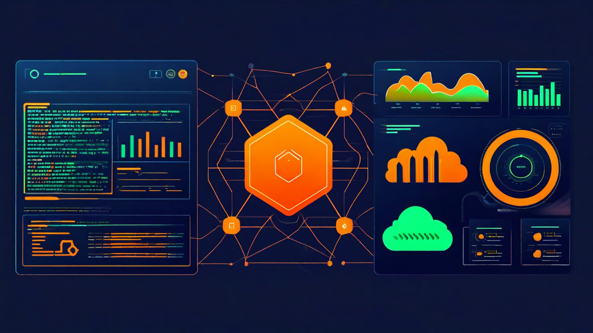
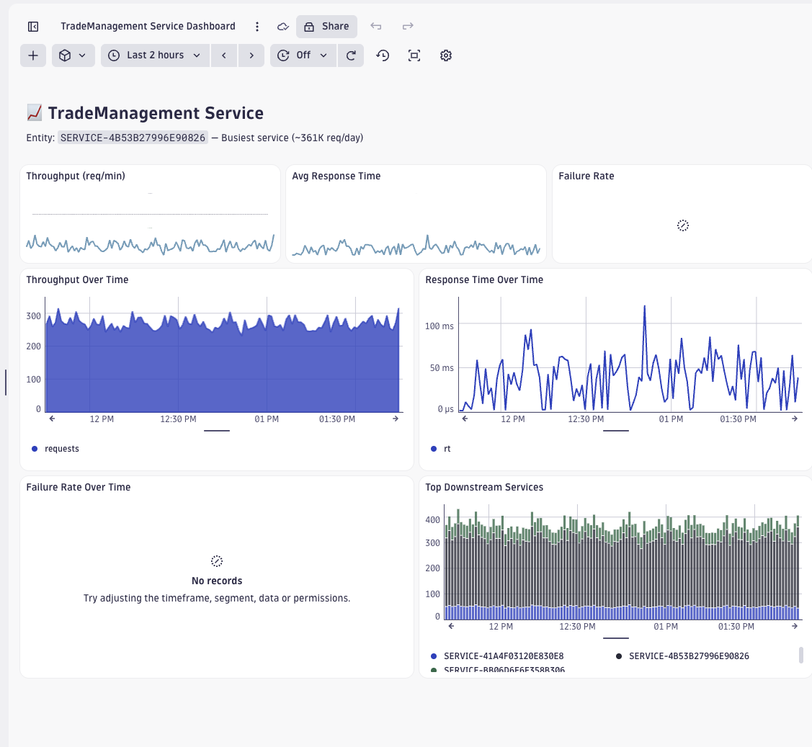

# Stop Tab-Switching to Investigate Incidents with Kiro + Dynatrace



<p>
 <strong>Dynatrace</strong> &nbsp;·&nbsp;
 <strong>AWS</strong> &nbsp;·&nbsp;
<strong>Kiro CLI</strong> &nbsp;·&nbsp;
<strong>ACP</strong>
</p>

**TL;DR:** Kiro CLI implements the Agent Client Protocol (ACP), which means it works as an AI agent in any compatible app — not just the terminal. Pair it with the Dynatrace MCP server, and you can query logs, investigate incidents, and manage dashboards from Obsidian, JetBrains, Zed, or anywhere else. Here's how we set it up and what it looks like in practice.

---

## The workflow that was slowing me down

I take notes in Obsidian. I investigate production issues in Dynatrace. I manage infrastructure in AWS. These three worlds never talked to each other.

My workflow looked like this: take messy meeting notes about an incident, switch to Dynatrace to pull traces and problems, switch to the AWS console to check ECS task health, then switch back to my notes to write it all up. Every context switch cost me time and mental energy.

What I wanted: ask questions about Dynatrace data without leaving my notes. And not just in Obsidian — in whatever tool I happen to be working in.

## The key insight: ACP makes Kiro composable

[Kiro CLI](https://kiro.dev/cli/) added support for the [Agent Client Protocol (ACP)](https://agentclientprotocol.com/) — an open standard that works like LSP, but for AI agents. Any ACP-compatible application can spawn `kiro-cli acp` and communicate with it over JSON-RPC.

This means Kiro isn't locked to the terminal. It's a composable agent that works in:
- **JetBrains IDEs** (IntelliJ, DataGrip, PyCharm, etc.)
- **Zed**
- **Obsidian** (via the [Agent Client plugin](https://github.com/RAIT-09/obsidian-agent-client))
- **Eclipse, Neovim, Emacs**, and any future ACP client

The critical part: Kiro's MCP server configuration travels with it. Configure Dynatrace once in `.kiro/settings/mcp.json`, and every ACP client gets access to the same Dynatrace tools.

## Connecting Kiro to Dynatrace 

Dynatrace provides a [remote MCP server](https://docs.dynatrace.com/docs/discover-dynatrace/platform/davis-ai/dynatrace-mcp) — hosted on their platform, no local dependencies. You connect to it with a URL and a platform token.

### 1. Create a platform token

Go to [myaccount.dynatrace.com/platformTokens](https://myaccount.dynatrace.com/platformTokens), create a token with scopes for MCP gateway access, storage reads, and Davis AI.

### 2. Configure the MCP server

Create `.kiro/settings/mcp.json`:

```json
{
  "mcpServers": {
    "dynatrace": {
      "url": "https://${DT_TENANT}.apps.dynatrace.com/platform-reserved/mcp-gateway/v0.1/servers/dynatrace-mcp/mcp",
      "headers": {
        "Authorization": "Bearer ${DT_PLATFORM_TOKEN}"
      }
    }
  }
}
```

Set the environment variables and you're done:

```bash
export DT_TENANT="abc12345"
export DT_PLATFORM_TOKEN="dt0s16...."
kiro-cli chat
```

No Node.js, no local server process, no OAuth browser flow. Just a URL and a token.

## The Obsidian setup

This is where ACP pays off. I installed the [Agent Client plugin](https://github.com/RAIT-09/obsidian-agent-client) in Obsidian, pointed it at `kiro-cli acp`, and that was it. Kiro picks up the Dynatrace MCP config from `~/.kiro/settings/mcp.json` automatically — no tokens to duplicate, no environment variables to set in Obsidian.

Now I can:

- **Investigate incidents from my meeting notes.** I'm taking notes during an incident review, and I ask Kiro to pull the Dynatrace problems and traces for the timeframe we're discussing. The data appears right in my chat panel.

- **Reference notes with `@` syntax.** I type `@Incident Review - 2026-03-15` and Kiro reads the note for context before querying Dynatrace.

- **Ask Davis AI questions.** "What was the root cause of the checkout-service degradation?" — Kiro calls Davis AI and returns the analysis without me opening a browser.

- **Correlate with AWS.** "Are the ECS tasks healthy for that service?" — Kiro shells out to the AWS CLI and cross-references with Dynatrace data.

## Adding dtctl for the write path 

The Dynatrace MCP server is excellent for querying — logs, problems, traces, entities, Davis AI. But when I need to create or modify Dynatrace resources (dashboards, workflows, SLOs), I use [dtctl](https://github.com/dynatrace-oss/dtctl).

dtctl is a kubectl-inspired CLI for Dynatrace that Kiro can invoke via shell. It handles the full CRUD lifecycle:

```
You: Create a dashboard showing error rate and p95 latency for checkout-service
```

Kiro generates a dashboard YAML and deploys it with `dtctl apply -f`. Here's a real dashboard Kiro created via dtctl:



```bash
dtctl describe dashboard "Checkout Health" -o yaml > dashboards/checkout-health.yaml
```

The split is clean:
- **MCP server** → read path (query, investigate, analyze)
- **dtctl** → write path (create, edit, deploy, version-control)

## The architecture


The beauty of this: I configured Dynatrace once. It works in my terminal, in Obsidian, in IntelliJ. If tomorrow a new ACP client appears, Kiro + Dynatrace will work there too — zero additional setup.

## Try it yourself

We've published a [starter repo](https://github.com/your-org/kiro-dynatrace-acp-starter) with:
- Pre-configured MCP server pointing to Dynatrace's remote gateway
- Steering rules that teach Kiro when to use MCP vs. dtctl
- An Obsidian vault with sample notes and prompts
- Five hands-on scenarios from basic log queries to automated rollback workflows

```bash
git clone https://github.com/your-org/kiro-dynatrace-acp-starter.git
cd kiro-dynatrace-acp-starter
export DT_TENANT="your-env-id"
export DT_PLATFORM_TOKEN="dt0s16...."
kiro-cli chat
```

---

*Kiro CLI is available at [kiro.dev](https://kiro.dev). The Dynatrace MCP server is documented at [docs.dynatrace.com](https://docs.dynatrace.com/docs/discover-dynatrace/platform/davis-ai/dynatrace-mcp). dtctl is open-source at [github.com/dynatrace-oss/dtctl](https://github.com/dynatrace-oss/dtctl).*
